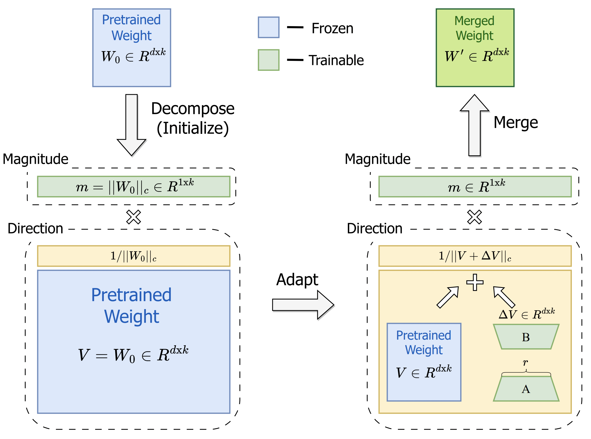
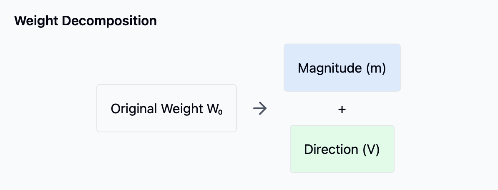
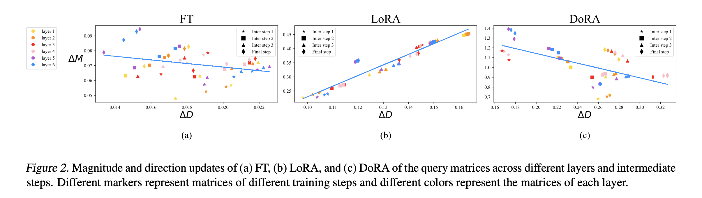
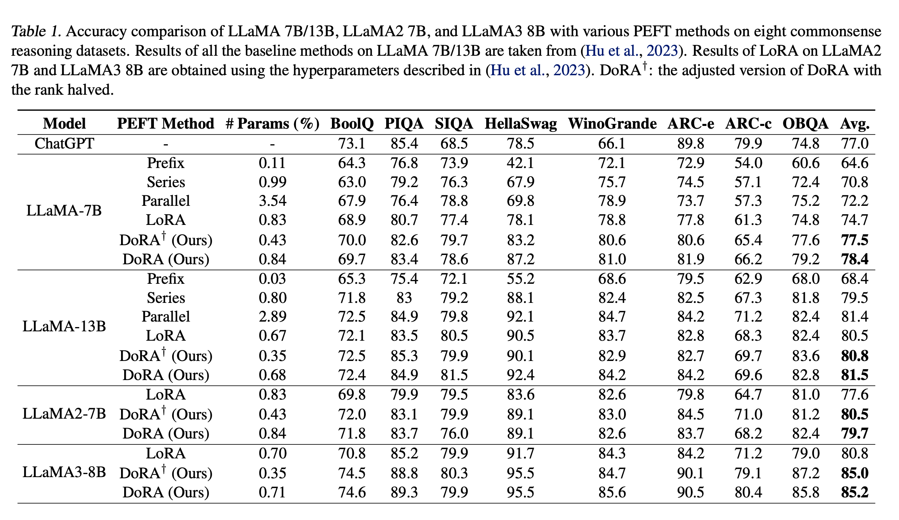
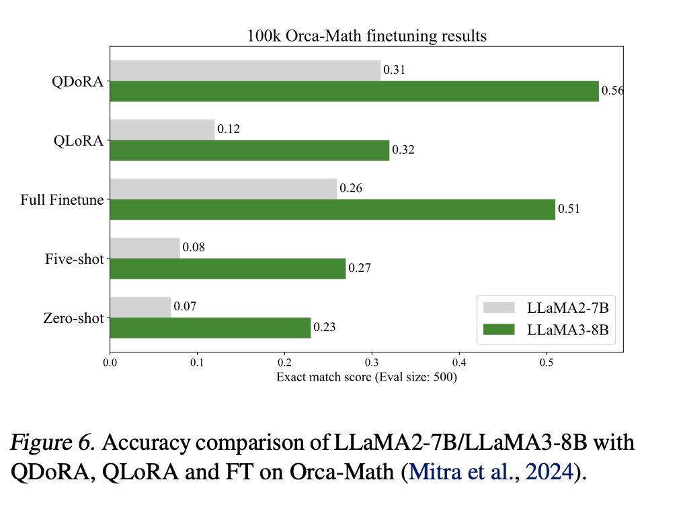

# DoRA: Weight-Decomposed Low-Rank Adaptation

## Overview:

Modern AI systems are built upon large pre-trained models like GPT, 
LLaMA, and BERT that have been trained on vast amounts of data. While 
these models are powerful, they often need to be fine-tuned for 
specific tasks or domains (like medical text analysis or legal 
document processing). However, full fine-tuning - updating all model 
parameters - has become increasingly impractical as models grow larger. 
For example, fine-tuning a 7B parameter model requires significant computational 
resources, often multiple high-end GPUs, and considerable storage space for each 
fine-tuned version. This creates barriers for researchers and developers with 
limited computing resources and makes it difficult to maintain multiple specialized versions of the same model.
To address this, the AI community has developed Parameter-Efficient 
Fine-Tuning (PEFT) methods. These techniques aim to adapt models using
 only a small subset of trainable parameters. Among these, Low-Rank 
 Adaptation (LoRA) has become particularly popular because it doesn't
 add any inference overhead. However, LoRA often can't match the 
 performance of full fine-tuning, creating a trade-off between 
 efficiency and accuracy that limits its practical utility.

## Existing Parameter-Efficient Fine-Tuning (PEFT) methods each come with significant trade-offs:

1. Adapter-based methods (like Houlsby Adapters) insert additional layers into the model, which increases inference time and computational overhead

2. Prompt-based methods (like P-Tuning) add learnable tokens, but are often sensitive to initialization and can be unstable during training

3. LoRA and its variants avoid inference overhead by using low-rank matrix approximations, but typically show reduced performance compared to full fine-tuning
    - They struggle to capture complex parameter interactions
    - Their learning patterns differ significantly from full fine-tuning
    - Increasing their rank to match full fine-tuning performance negates their efficiency benefits

These limitations have created a critical gap in the field: the need for a method that can achieve full fine-tuning-level performance while maintaining the efficiency benefits of PEFT approaches.

## DoRA

DoRA decomposes the pre-trained weight into two components, 
magnitude and direction, for fine-tuning, specifically employing 
LoRA for directional updates to minimize the number of trainable 
parameters efficiently. By employing DoRA, we enhance both the 
learning capacity and training stability of LoRA while avoiding 
any additional inference overhead. DoRA consistently outperforms 
LoRA on fine-tuning LLaMA, LLaVA, and VL-BART on various downstream 
tasks, such as commonsense reasoning, visual instruction tuning, and 
image/video-text understanding.

The architecture of DoRA stems from two key innovations:
1. a novel weight decomposition analysis that reveals fundamental differences between LoRA and full fine-tuning
2. a new method that leverages these insights to improve parameter-efficient fine-tuning.



## Weight Decomposition Analysis
The authors introduce a novel analysis that decomposes weight matrices into magnitude and directional components to study how LoRA and full fine-tuning differ in their learning patterns.
It is inspired by Weight Normalization, which reparameterizes neural network weights to improve optimization. 

For any weight matrix W ∈ ℝᵈˣᵏ:
z
$$
W = m * (V/||V||c)
$$
where:
- m ∈ ℝ¹ˣᵏ is the magnitude vector
- V ∈ ℝᵈˣᵏ is the directional matrix
- ||V||c denotes column-wise normalization
This analysis revealed a crucial insight: LoRA and full fine-tuning exhibit markedly different update patterns:



## Pseudocode
### LoRA Approach

LoRA directly learns weight updates through low-rank decomposition:
```python
def LoRA(W₀):
    # W₀: pretrained weight matrix ∈ ℝᵈˣᵏ
    # r: rank (hyperparameter, typically r << min(d,k))
    
    # Initialize trainable matrices
    A ∈ ℝʳˣᵏ  # initialized with Kaiming uniform
    B ∈ ℝᵈˣʳ  # initialized with zeros
    
    # Weight update
    ΔW = B @ A
    
    # Final adapted weight
    W' = W₀ + ΔW
    
    return W'
```

### DoRA Approach
DoRA decomposes weights into magnitude and direction components, makes magnitude directly trainable then applies LoRA specifically to directional updates:

```python
def DoRA(W₀):
    # W₀: pretrained weight matrix ∈ ℝᵈˣᵏ
    
    # 1. Weight Decomposition
    m = ||W₀||c      # magnitude vector ∈ ℝ¹ˣᵏ (trainable)
    V = W₀/||W₀||c   # direction matrix (frozen)
    
    # 2. Initialize LoRA components for directional update
    A ∈ ℝʳˣᵏ  # initialized with Kaiming uniform
    B ∈ ℝᵈˣʳ  # initialized with zeros
    
    # 3. Update Steps
    ΔV = B @ A                    # Learn directional update
    V' = V + ΔV                   # Update direction
    V_normalized = V'/||V'||c     # Normalize direction
    
    # 4. Final adapted weight
    W' = m * V_normalized         # Combine magnitude and direction
    
    return W'
```


## Key Differences:

Component Separation:
- LoRA: Operates directly on weight updates
- DoRA: Separates magnitude (m) and direction (V) components

Update Mechanism:
- LoRA: Learns full weight updates through low-rank matrices
- DoRA: Learns directional updates through LoRA while independently updating magnitude

Normalization:
- LoRA: No explicit normalization
- DoRA: Maintains unit-normalized directions through explicit normalization

Learning Capacity:
- LoRA: Must learn both magnitude and direction changes together
- DoRA: Can independently optimize magnitude and direction, allowing for more nuanced updates

This decomposition allows DoRA to better mimic full fine-tuning's learning patterns while maintaining parameter efficiency. Despite the more complex architecture, both methods have the same inference cost as the weights can be merged post-training.

### Question : Why does DoRA show better learning capacity than LoRA? 




The key difference lies in how each method updates weights:

- **LoRA's Limitation**: Shows a positive correlation between magnitude and directional changes, meaning it must update both components proportionally. This constrains its ability to make subtle adjustments to either component independently.

- **DoRA's Advantage**: Exhibits a negative correlation pattern similar to full fine-tuning, allowing it to make:
  1. Large magnitude changes with minimal directional adjustments, or
  2. Significant directional updates while keeping magnitudes relatively stable

This flexibility in updating weights independently makes DoRA more capable of fine-grained adaptations, leading to better task-specific optimization. The separation of magnitude and direction components simplifies the learning problem compared to LoRA, which must learn both aspects simultaneously through its low-rank approximation.

### Question : Why might smaller directional changes with larger magnitude updates (or vice versa) be beneficial for model adaptation?

Scenario 1: Enhancing Existing Knowledge
- Large magnitude change: Scale up important features
- Small directional change: Preserve learned patterns
- Result: Strengthens relevant features without disruption

Scenario 2: Learning New Patterns
- Large directional change: Learn new feature directions
- Small magnitude change: Carefully introduce new patterns
- Result: Adds new capabilities without overwhelming existing ones

## Experiments and Results

DoRA was evaluated extensively across different architectures and tasks, demonstrating consistent improvements over LoRA. Here are the key experimental findings:

### 1. Commonsense Reasoning Tasks
- **Models tested**: LLaMA-7B/13B, LLaMA2-7B, and LLaMA3-8B
- **Dataset**: 8 reasoning tasks including BoolQ, PIQA, SIQA, HellaSwag
- **Results**:
  - LLaMA-7B: +3.7% over LoRA (78.4% vs 74.7%)
  - LLaMA-13B: +1.0% improvement (81.5% vs 80.5%)
  - LLaMA2-7B: +2.9% gain (80.5% vs 77.6%)
  - LLaMA3-8B: +4.4% improvement (85.2% vs 80.8%)
  - Achieved these gains while using only 0.8% of full model parameters

### 2. Vision-Language Tasks
- **Models**: LLaVA-1.5-7B and VL-BART
- **Tasks**: 
  - Visual instruction tuning
  - Image/video-text understanding
  - Visual QA and reasoning
- **Results**:
  - LLaVA: +0.7% improvement in average accuracy
  - VL-BART: +0.9% gain in image tasks, +1.9% in video tasks
  - Matched or exceeded full fine-tuning performance in some cases

### 3. Parameter Efficiency Analysis
- **Rank Variations**: Tested ranks {4, 8, 16, 32, 64}
- **Key Finding**: 
    DoRA maintains high performance even at lower ranks
  - At rank=8: DoRA achieves 77.96% vs LoRA's 40.74%
  - Shows better parameter efficiency than LoRA

### 4. Integration with Other Methods
- Successfully combined with VeRA (DVoRA)
- Tested on instruction tuning with Alpaca dataset
- DVoRA achieved LoRA-level performance with significantly fewer parameters



### 5. Practical Applications
- **Text-to-Image Generation**: 
  - Better personalization in SDXL fine-tuning
- **QDoRA**: 
Integration with quantization showing promising results
  - Improved accuracy while maintaining memory efficiency
  - Successful implementation with consumer GPUs



## Critical Analysis:
1. Limited analysis of training time and memory requirements for computational overhead during training
2. Could benefit from investigation in other domains like audio processing or time-series analysis
3. No extensive analysis of the impact of learning rate ratios between magnitude and direction updates


# Impact

DoRA's introduction has significant implications for both current AI development and future research directions:

## Current Impact

### Technical Advances
- Bridges the performance gap between efficient fine-tuning and full fine-tuning
- Introduces a new way to analyze and understand weight updates in neural networks

### Practical Benefits
- Makes high-quality model adaptation more accessible to researchers with limited compute resources
- Enables efficient creation of specialized models for different tasks or domains
- Reduces storage requirements for maintaining multiple fine-tuned variants

### Industry Applications
- Improves text-to-image model personalization
- Enables better language model adaptation for specific domains
- Reduces deployment costs while maintaining performance

## Future Implications

### Research Directions
- Opens new avenues for understanding neural network optimization
- Suggests potential for similar decomposition strategies in other deep learning contexts
- May influence the design of future parameter-efficient training methods

### Technical Development
- Could lead to new architectures designed specifically for efficient adaptation
- May inspire new approaches to model compression and optimization
- Potential applications in continual learning and multi-task adaptation

### Broader Impact
- Makes AI model customization more environmentally sustainable
- Democratizes access to high-quality model adaptation
- Could accelerate the development of specialized AI applications

The method's success in combining efficiency with performance suggests a broader paradigm shift in how we approach model adaptation, potentially influencing the development of future AI systems and their deployment strategies.

# Resorces:

- [https://arxiv.org/abs/2402.09353](https://)
- [https://github.com/NVlabs/DoRA](https://)
- [https://nbasyl.github.io/DoRA-project-page/](https:)

