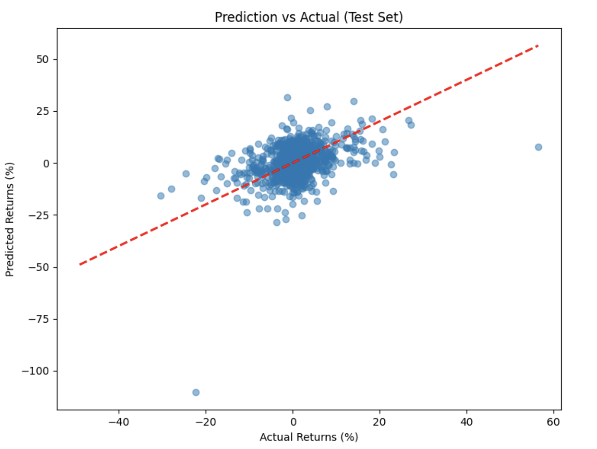

# Stock News Article Analysis

## Overview: 

This project analyzes the impact of news articles on stock price movements using an LLM-based embeddings approach. The goal is to understand if news content can help predict short-term stock price changes. The project was done using a dataset containing stock news articles along with corresponding price data to train a model that can predict price movements based on news content.
The approach combines text embeddings from news articles with price and temporal features to predict 5-day returns. We use a Ridge regression model and analyze feature importance to understand what drives predictions.

## Key features: 

- Text embedding generation using LLaMA embeddings
- Integration of multiple data types (news text, price data)
- Predictive modeling using Ridge regression
- Feature importance analysis to understand key drivers
- Visualization of model performance and feature contributions

## Critical Analysis:
### Project Impact and Implications:
The project reveals several important insights about the relationship between financial news and stock price movements:

1. Text Dominance in Predictions
- News content accounts for 81% of the model's predictive power
- This strongly suggests that qualitative information in news articles has significantly more influence on stock movements than technical indicators

2. Model Performance Challenges
- The significant gap between training (R² = 0.77) and test (R² = -0.74) performance indicates substantial overfitting
- This suggests that while news article has predictive value, the relationship is complex and difficult to generalize

3. Feature Importance Distribution

- Text features: 81%
- Price features: 17.5%
- Stock features: 1.36%
- Date features: 0.07%
- This hierarchy provides insight into what information market participants prioritize when making trading decisions

- Shows how the model weights different features
- Most coefficients are concentrated near zero with some outliers

### Model Performance:

- Train R²: 0.7786
- Test R²: -0.7397
- Train RMSE: 2.8821
- Test RMSE: 8.3245

- This suggests severe overfitting - the model learned training data patterns too specifically and fails to generalize

## Limitations and Challenges

1. Data Quality Issues

- Limited number of news articles used
- Potential selection bias in news coverage
- No intraday price movements captured

2. Technical Constraints

- Current embeddings may not capture all nuances of financial text
- Model architecture may be too simple for the complexity of market dynamics
- Processing time for text embeddings limits real-time applications

## Future Research Directions

1. Model Improvements

- Experiment with various transformer-based architectures
- Incorporate attention mechanisms to better capture context
- Develop ensemble methods combining multiple prediction approaches

2. Data Enhancements

- Include broader news sources
- Add social media sentiment
- Incorporate intraday price data
- Consider macroeconomic indicators

## Data Sources

- Stock news dataset from HuggingFace containing articles and price data

## Resources

- Dataset link : [https://huggingface.co/datasets/oliverwang15/us_stock_news_with_price](https://)